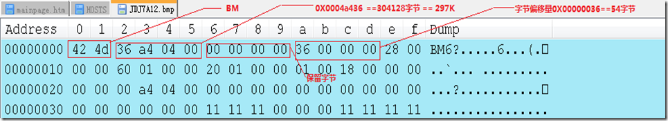
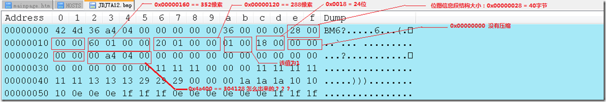

# BMP文件结构
## 概览
BMP(Bitmap-File)图形文件，又叫位图文件，是Windows采用的图形文件格式，在Windows环境下运行的所有图象处理软件都支持BMP图象文件格式。Windows系统内部各图像绘制操作都是以BMP为基础的。一个BMP文件由四部分组成：
1. 位图文件头
2. 位图信息段
3. 调色板
4. 位图数据


C++代码表示如下：
```
typedef struct BITMAP_FILE
{
	BITMAPFILEHEADER	fileHeader;		//文件头
	BITMAPINFOHEADER	InfoHeader;		//信息段
	PALETTEENTRY 		*palette;		//调色板信息
	BYTE				*buffer;		//图片信息，BYTE为1个字节
} BITMAP_FILE;
```
## 各部分内容
### 1. 文件头BITMAPFILEHEADER

```
typedef struct BITMAPFILEHEADER {
	WORD	brType;			//WORD为2个字节
	DWORD	bfSize;			//DWORD为4个字节
	WORD	bfReserved1;
	WORD	bfReserved2;
	DWORD	bfOffBits;
} BITMAPFILEHEADER;
```
| 属性 | 说明 |
| ------- | ------ |
| bfType | 表明文件类型，该值必须是0x4D42，对应ASCII码的字符"BM"|
| bfSize | 说明该位图文件的大小，以字节为单位 |
| bfReserved1 | 保留，必须设置为0 |
| bfReserved2 | 保留，必须设置为0 |
| bfOffBits | 说明从文件头开始到实际的图象数据之间的字节的偏移量。即文件总大小bfSize - sizeof(BITMAPINFOHEADER) - sizeof(BITMAPINFOHEADER) - 调色板大小 |

WinHex打开某bmp文件：



bfType: 0x4d42 对应字符"BM"
bfSize: 0x0004a436 = 297K字节，即文件总大小
bfReserved1, bfReserved2: 保留字节，均为0
bfOffBits: 0x00000036 = 54字节(即为sizeof(BITMAPINFOHEADER) + sizeof(BITMAPINFOHEADER)，说明这个图片没有调色板信息)
### 2. 位图信息段
```
typedef struct tagBITMAPINFOHEADER{
	DWORD  biSize;
	LONG   biWidth;
	LONG   biHeight;
	WORD   biPlanes;
	WORD   biBitCount;
	DWORD  biCompression;
	DWORD  biSizeImage;
	LONG   biXPelsPerMeter;
	LONG   biYPelsPerMeter;
	DWORD  biClrUsed;
	DWORD  biClrImportant;
} BITMAPINFOHEADER;
```
| 属性 | 说明 |
| ------- | ------ |
| biSize | 声明BITMAPINFOHEADER结构的字节数(40) |
| biWidth | 图像宽度，单位为像素 |
| biHeight | 图像高度，单位为像素 *\*高度可以也可以为负数。如果为一个正数，则说明图像是倒向的；如果为一个负数，则说明图像是正向的。大多数BMP文件均为倒向的。* |
| biPlanes | bmp图片的平面属，显然显示器只有一个平面，所以恒等于1 *\*不理解* |
| biBitCount | 说明表示每像素颜色所用的位数(bit)，其值为1,4,8,16,24,32。 |
| biCompression | 说明图像数据压缩的类型，其中：<br>BI_RGB: 没有压缩<br>BI_RLE8: 每个像素8bit的RLE压缩编码，压缩格式由2字节组成(重复像素计数和颜色索引)<br>BI_RLE4: 每个像素4bit的RLE压缩编码，压缩格式由2字节组成<br>BI_BITFIELDS: 每个像素的bit由指定的掩码决定<br>BI_JPEG: JPEG格式|
| biSizeImage | 说明图像大小，以字节为单位。当用BI_RGB格式时，可设置为0。 |
| biXPelsPerMeter | 说明水平分辨率，单位像素/米*\*不理解* |
| biYPelsPerMeter | 说明垂直分辨率，单位像素/米*\*不理解* |
| biClrUsed | 说明位图实际使用的彩色表中的颜色索引数（设为0的话，则说明使用所有调色板项）*\*不理解* |
| biClrImportant | 说明对图象显示有重要影响的颜色索引的数目，如果是0，表示都重要*\*不理解* |



biSize: BITMAPINFOHEADER结构的字节数0x00000028 = 40字节
biWidth: 0x00000160 = 352像素
biHeight: 0x00000120 = 288像素
biPlanes: 0x0001 = 1
biBitCount: 0x0018 = 24
biCompression: 没有压缩
biSizeImage: 0x0004a400 = 304128
biXPelsPerMeter: 0x00000000
biYPelsPerMeter: 0x00000000
biClrUsed: 0x00000000
biClrImportant: 0x00000000

**这里的biWidth必须是4的倍数，如果不是4的倍数，则需要取4的倍数，比如241，则取244。
为什么必须是4的倍数？这里涉及到一个行对齐的问题：
由于Windows在进行行扫描的时候最小的单位为4个字节，所以当
图片宽 X 每个像素的字节数 != 4的整数倍
时要在每行的后面补上缺少的字节，以0填充**
